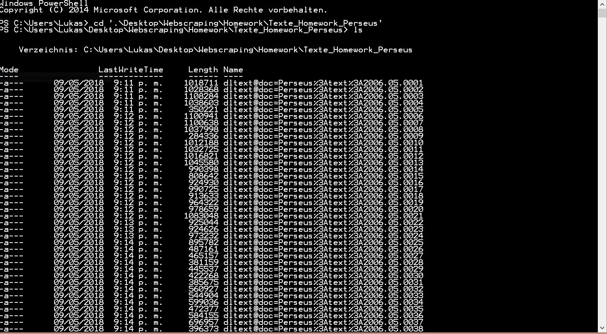

1. I copied the Source Code of <http://www.perseus.tufts.edu/hopper/collection?collection=Perseus:collection:RichTimes> to a txt-file with wget.

2. Then i used a Regular Expression to filter the right links, which are the ones connecting to the issue-page. 
Used Regular Expression: ```text[?]doc.*.2006.\d\d.\d\d\d\d```

4. I added the missing parts in the link, so the downloadable XML-Version of the newspaper-issue is used by wget.exe. 
This was necessary else because the normal link on the primary page can´t be used to download the issue. 
The used regular expression was: ```^ www.perseus.tufts.edu/hopper/dl```

5. Over the command line i used wget to download the xml-version of the articles. 
The links have been collected in a plain text file before, so wget could use them.
Used command was: ```wget.exe -i Download_links.txt```


Here you can also see a part of the downloaded files in my command line:
