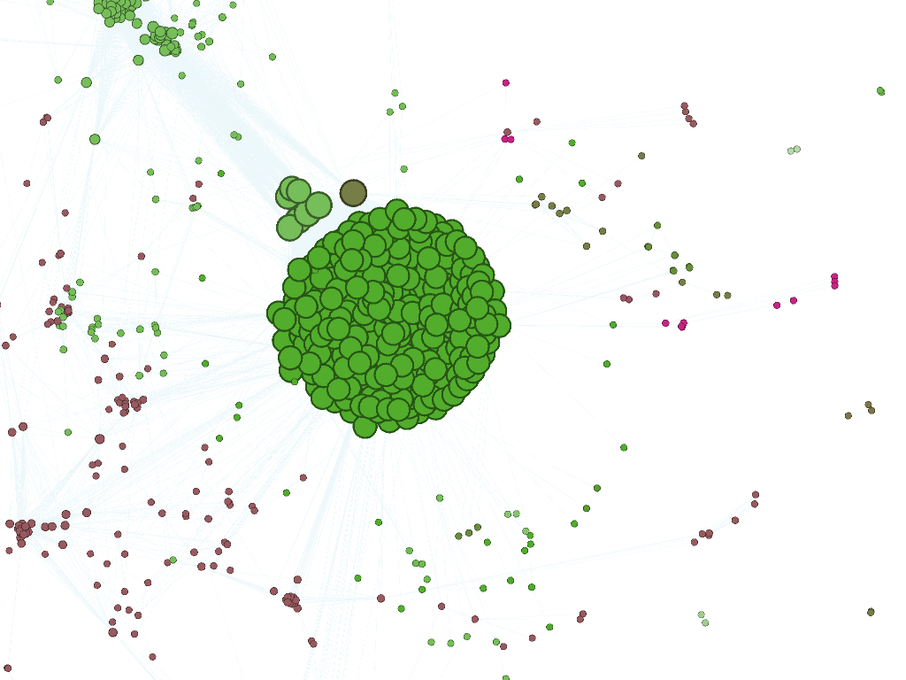
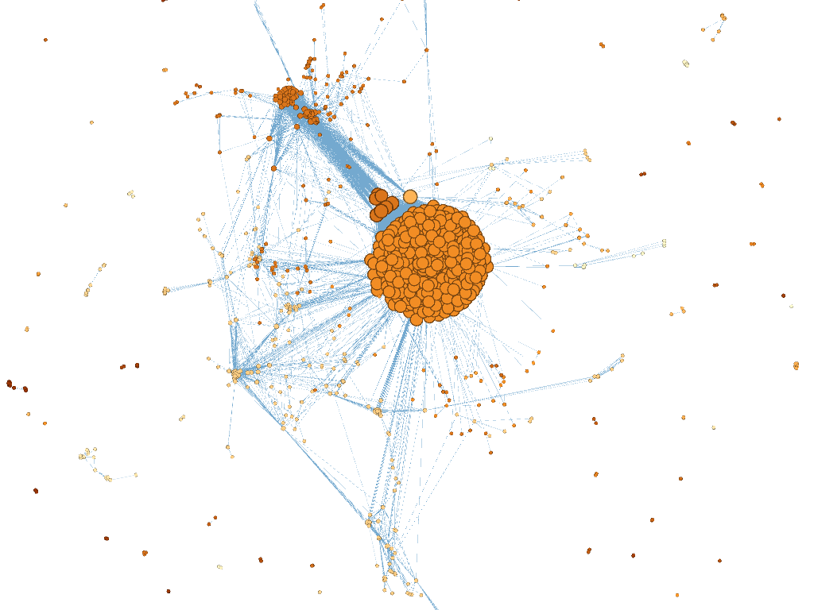
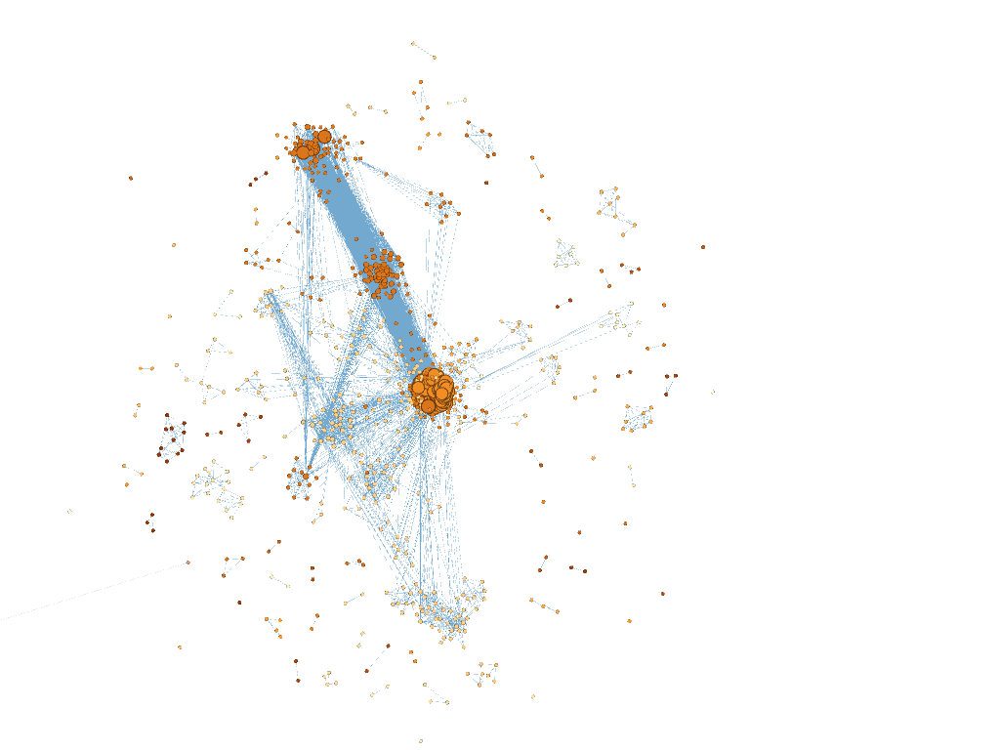

The first part of our last homework was to built a network based on people from the dispatch. For this task i adopted the script provided by erika as mine wasn´t fully working.


```Python

import re, os

source = ".//Input" #source foulder
target = ".//Result" #target directory

#create a list and a dictionary to save the extracted information to
edgesDic = {} # dictionary for edges
edgesList = [] # list for names

def updateDic(dic, key): # updating dictionary, we got this piece of code
	if key in dic:
		dic[key] += 1
	else:
		dic[key] = 1
	
def taggedNames(unitText): # define function to collect tagged names in edgesList
	namesInUnit = [] #create list for names in unit
	for names in re.findall(r'<[pP]ersName[^<]+', unitText, flags=0):
		match = re.search(r'authname="([\w,]+)"', names)
		if match:
			name = match.group(1) #filter names													
			name = name.lower()
			namesInUnit.append(name)
	return namesInUnit

import itertools # creating edges from a list, we got that code from our teacher as well
def edges(edgesList, edgesDic):
	edges = list(itertools.combinations(edgesList, 2))
	for e in edges:
		key = "\t".join(sorted(list(e))) # A > B (sorted alphabetically, to avoid cases of B > A)
		updateDic(edgesDic, key)	

lof = os.listdir(source)
lof.sort()

for file in lof:
	with open(source + "/" + file, "r", encoding="utf8") as f1:
		text = f1.read()
			
		split = re.split('<div3', text) # split the text into units
		for unit in split[1:]:
			unit = "<div3" + unit # restore the integrity of units		
			# print(unit) #testing
			
			namesList = taggedNames(unit) # set value		
			edges(namesList, edgesDic) #create edges from nameslist


with open(target+"/"+"result.tsv", "w", encoding="utf8") as resultFile:
	resultFile.write("source\ttarget\tweight\n")
	for edge in edgesDic: # separate key, value with tabs
		entry = edge+"\t"+str(edgesDic[edge])+"\n"
		resultFile.write(entry)
```

I got a tsv-file with source of the connection, the target (a connection) and the counted weight of the relation. The skript only created an edges-file with a weight of the relationship without further description. A nodes file wasn´t created, because it would´t be possible in all cases and further it can make things even more complicated.
After that i imported the tsv-file as an edges file in gephi. Than i changed the color and size of the nodes and although of the edges to make the differences more self-evident.
In a last step i changed the layout and tested several algorithms. The first two pictures were constructed with force atlas 1 (green) and force atlas 2 (orange). The last one was constructed with OpenOrd and was by the best solution in case of readability.
In the literature it was also noted that this layout can be helpful in organizing big data networks. 










In all versions it is recognizable that there are several small separated networks of two, three or more individuals and one big network. In most cases the number of connections is low, but in some cases it gets to over 100, which in any cases highers the aspect of centrality for an individual.
People with such a high quantity of Connections shut be further identified to higher the scientic value of a network. For example the connection breckinridge to breckinridge was counted over 1000 times in the dispatch. 
This has to be clarified as under this name there are several individual members and not always the same two people in the dispatch. Maybe it could be also helpful to only search through the articles as those can show a better quality of connection. 

i did this and added this line of code:
```Python
unittype = re.findall(r'<div3 type="article"[^<]+>', unitText, flags=0)
                if unittype:
```

This changed the results a bit, because it excluded several connections belonging to adverticement.
Still the network took a big amount of time to load in gephi. 
